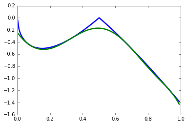

********
Examples
********

Example 1: Max-cut
======================================================
This is a polynomial optimization problem of commutative variables mentioned in
Section 5.12 of Henrion et. al (2009). We rely on NumPy to remove the equality constraints from the problem

::

    import numpy as np
    W = np.diag(np.ones(8), 1) + np.diag(np.ones(7), 2) + np.diag([1, 1], 7) + \
        np.diag([1], 8)
    W = W + W.T
    n = len(W)
    e = np.ones(n)
    Q = (np.diag(np.dot(e.T, W)) - W) / 4

    x = generate_variables('x', n)
    equalities = [xi ** 2 - 1 for xi in x]

    objective = -np.dot(x, np.dot(Q, np.transpose(x)))

    sdp = SdpRelaxation(x)
    sdp.get_relaxation(1, objective=objective, equalities=equalities,
                       removeequalities=True)
    sdp.solve()

Example 2: Parametric Polynomial Optimization Problems
======================================================
In a parametric polynomial optimization problem, we can separate two sets of variables, and one set acts as a parameter to the problem. More formally, we would like to find the following function:

.. math::

   J(x) = \inf_{y\in\mathbb{R}^m}\{f(x,y): h_j(y)\geq 0, j=1,\ldots,r\}

where :math:`x\in\mathbf{X}=\{x\in \mathbb{R}^n: h_k(x)\geq 0, k=r+1,\ldots,t\}`. We can approximate :math:`J(x)` using the dual an SDP relaxation. The following implements Example 4 from Lasserre (2010).

.. code:: python

    from sympy import integrate, N
    import matplotlib.pyplot as plt

    def J(x):
        return -2*abs(1-2*x)*sqrt(x/(1+x))

    def Jk(x, coeffs):
        return sum(ci*x**i for i, ci in enumerate(coeffs))

    x = generate_variables('x')[0]
    y = generate_variables('y', 2)
    f = (1-2*x)*(y[0] + y[1])

    gamma = [integrate(x**i, (x, 0, 1)) for i in range(1, 2*level+1)]
    marginals = [x**i-N(gamma[i-1]) for i in range(1, 2*level+1)]

    inequalities = [x*y[0]**2 + y[1]**2 - x,  - x*y[0]**2 - y[1]**2 + x,
                    y[0]**2 + x*y[1]**2 - x,  - y[0]**2 - x*y[1]**2 + x,
                    1-x, x]
    sdp = SdpRelaxation(flatten([x, y]))
    sdp.get_relaxation(level, objective=f, momentequalities=marginals,
                       inequalities=inequalities)
    sdp.solve()
    coeffs = [sdp.extract_dual_value(0, range(len(inequalities)+1))]
    coeffs += [sdp.y_mat[len(inequalities)+1+2*i][0][0] - sdp.y_mat[len(inequalities)+1+2*i+1][0][0]
               for i in range(len(marginals))]
    plt.plot(x_domain, [J(xi) for xi in x_domain], linewidth=2.5)
    plt.plot(x_domain, [Jk(xi, coeffs) for xi in x_domain], linewidth=2.5)
    plt.show() 

Example 3: Sparse Relaxation with Chordal Extension
===================================================
This method replicates the behaviour of SparsePOP (Waki et. al, 2008). The following is a 
simple example:

::

    level = 2
    X = generate_variables('x', 3)

    obj = X[1] - 2*X[0]*X[1] + X[1]*X[2]
    inequalities = [1-X[0]**2-X[1]**2, 1-X[1]**2-X[2]**2]

    sdp = SdpRelaxation(X)
    sdp.get_relaxation(level, objective=obj, inequalities=inequalities,
                       chordal_extension=True)
    sdp.solve()
    print(sdp.primal, sdp.dual)

Example 4: Mixed-Level Relaxation of a Bell Inequality
======================================================

It is often the case that moving to a higher-order relaxation is
computationally prohibitive. For these cases, it is possible to inject
extra monomials to a lower level relaxation. We refer to this case as a
mixed-level relaxation.

As an example, we consider the CHSH inequality in the probability
picture at level 1+AB relaxation. The lazy way of doing this is as follows:

::

    level = 1
    I = [[ 0,   -1,    0 ],
         [-1,    1,    1 ],
         [ 0,    1,   -1 ]]
    print(maximum_violation(A_configuration, B_configuration, I, level, 
          extra='AB')

This will immediately give you the negative of the maximum violation. 
The function `maximum_violation` only works for two-party configuration, so for
educational purposes, we spell out what goes on in the background. With `level`
and `I` defined as above, we create the measurements that will make up the
probabilities, and define the objective function with the `I` matrix.
          
::

    P = Probability([2, 2], [2, 2])
    objective = define_objective_with_I(I, P)

Unfortunately, the function `define_objective_with_I` only works for two parties
again, which is not surprising, as it would be hard to define an `I` matrix for 
more than two parties. So if you have a multipartite scenario, you can use the 
probabilities to define your Bell inequality. For the CHSH, it is

::

    CHSH = -P([0],[0],'A') + P([0,0],[0,0])  + P([0,0],[0,1]) + \
            P([0,0],[1,0]) - P([0,0],[1,1]) - P([0],[0],'B')

Note that we can only minimize a function, so we have to flip the sign to get 
the same objective function as above:

::

    objective = -CHSH

We need to generate the monomials we would like to add to the
relaxation. This is aided by a helper function in the class `Probability`. We
only need to provide the strings we would like to see -- this time it is AB:

::

    sdp = SdpRelaxation(P.get_all_operators())
    sdp.get_relaxation(level, objective=objective,
                       substitutions=P.substitutions,
                       extramonomials=P.get_extra_monomials('AB'))
    sdp.solve()
    print(sdp.primal)

Example 5: Additional manipulation of the generated SDPs with PICOS
===================================================================
A compatibility layer with PICOS allows additional manipulations of the 
optimization problem and also calling a wider ranger of solvers. 
Assuming that the PICOS dependencies are in ``PYTHONPATH``, we
can pass an argument to the function ``get_relaxation`` to generate a
PICOS optimization problem. Using the same example as before, we change
the relevant function call to:

::

    P = sdp.convert_to_picos()

This returns a PICOS problem. For instance, we can manually define the value
of certain elements of the moment matrix before solving the SDP:

::

    X = P.get_variable('X')
    P.add_constraint(X[0, 1] == 0.5)

Finally we can solve the SDP with any of solvers that PICOS supports:

::

    P.solve()

Example 6: Bosonic System
==================================================

The system Hamiltonian describes :math:`N` harmonic oscillators with a
parameter :math:`\omega`. It is the result of second quantization and it
is subject to bosonic constraints on the ladder operators :math:`a_{k}`
and :math:`a_{k}^{\dagger}` (see, for instance, Section 22.2 in M.
Fayngold and Fayngold (2013)). The Hamiltonian is written as

.. math:: H = \hbar \omega\sum_{i}\left(a_{i}^{\dagger}a_{i}+\frac{1}{2}\right).

Here :math:`^{\dagger}` stands for the adjoint operation. The
constraints on the ladder operators are given as

.. math::

   \begin{aligned}
   [a_{i},a_{j}^{\dagger}] &=  \delta_{ij} \\
   [a_{i},a_{j}]  &=  0 \nonumber \\
   [a_{i}^{\dagger},a_{j}^{\dagger}] &=  0,\nonumber\end{aligned}

where :math:`[.,.]` stands for the commutation operator
:math:`[a,b]=ab-ba`.

Clearly, most of the constraints are monomial substitutions, except
:math:`[a_{i},a_{i}^{\dagger}]=1`, which needs to be defined as an
equality. The Python code for generating the SDP relaxation is provided
below. We set :math:`\omega=1`, and we also set Planck’s constant
:math:`\hbar` to one, to obtain numerical results that are easier to
interpret.

::

    from sympy.physics.quantum.dagger import Dagger

    level = 1          # Level of relaxation
    N = 4              # Number of variables
    hbar, omega = 1, 1 # Parameters for the Hamiltonian

    # Define ladder operators
    a = generate_operators('a', N)

    hamiltonian = sum(hbar*omega*(Dagger(ai)*ai+0.5) for ai in a)
    substitutions = bosonic_constraints(a)

    sdp = SdpRelaxation(a)
    sdp.get_relaxation(level, objective=hamiltonian,
                       substitutions=substitutions)
    sdp.solve()

The result is very close to two. The result is similarly precise for arbitrary numbers 
of oscillators.

It is remarkable that we get the correct value at the first level of
relaxation, but this property is typical for bosonic systems (Navascués
et al. 2013).

Example 7: Using the Nieto-Silleras Hierarchy
==================================================

One of the newer approaches to the SDP relaxations takes all joint
probabilities into consideration when looking for a maximum guessing
probability, and not just the ones included in a particular Bell
inequality (Nieto-Silleras, Pironio, and Silman 2014; Bancal, Sheridan,
and Scarani 2014). Ncpol2sdpa can generate the respective hierarchy.

To deal with the joint probabilities necessary for setting constraints,
we also rely on QuTiP (Johansson, Nation, and Nori 2013):

::

    from math import sqrt
    from qutip import tensor, basis, sigmax, sigmay, expect, qeye

We will work in a CHSH scenario where we are trying to find the maximum
guessing probability of the first projector of Alice’s first
measurement. We generate the joint probability distribution on the
maximally entangled state with the measurements that give the maximum
quantum violation of the CHSH inequality:

::

    psi = (tensor(basis(2,0),basis(2,0)) + tensor(basis(2,1),basis(2,1))).unit()
    A = [(qeye(2) + sigmax())/2, (qeye(2) + sigmay())/2]
    B = [(qeye(2) + (-sigmay()+sigmax())/sqrt(2))/2,
         (qeye(2) + (sigmay()+sigmax())/sqrt(2))/2]

Next we need the basic configuration of the probabilities and we must make them
match the observed distribution.

::

    P = Probability([2, 2], [2, 2])
    behaviour_constraints = [
      P([0],[0],'A')-expect(tensor(A[0], qeye(2)), psi),
      P([0],[1],'A')-expect(tensor(A[1], qeye(2)), psi),
      P([0],[0],'B')-expect(tensor(qeye(2), B[0]), psi),
      P([0],[1],'B')-expect(tensor(qeye(2), B[1]), psi),
      P([0,0],[0,0])-expect(tensor(A[0], B[0]), psi),
      P([0,0],[0,1])-expect(tensor(A[0], B[1]), psi),
      P([0,0],[1,0])-expect(tensor(A[1], B[0]), psi),
      P([0,0],[1,1])-expect(tensor(A[1], B[1]), psi)]

We also have to define normalization of the subalgebras, in this case, only one:

::

    behaviour_constraints.append("-0[0,0]+1.0")
    
From here, the solution follows the usual pathway:

::

    level = 1
    sdp = SdpRelaxation(P.get_all_operators(), normalized=False, verbose=1)
    sdp.get_relaxation(level, objective=-P([0],[0],'A'), 
                       momentequalities=behaviour_constraints,
                       substitutions=P.substitutions)
    sdp.solve()
    print(sdp.primal, sdp.dual)

Example 8: Using the Moroder Hierarchy
==================================================

This type of hierarchy allows for a wider range of constraints of the
optimization problems, including ones that are not of polynomial
form (Moroder et al. 2013). These constraints are hard to impose using
SymPy and the sparse structures in Ncpol2Sdpa. For this reason, we
separate two steps: generating the SDP and post-processing the SDP to
impose extra constraints. This second step can be done in MATLAB, for
instance.

Then we set up the problem with specifically with the CHSH inequality in
the probability picture as the objective function. This part is
identical to the one discussed in Section [mixedlevel].

::

    I = [[ 0,   -1,    0 ],
         [-1,    1,    1 ], 
         [ 0,    1,   -1 ]]
    P = Probability([2, 2], [2, 2])
    objective = define_objective_with_I(I, P)

When obtaining the relaxation for this kind of problem, it can prove
useful to disable the normalization of the top-left element of the
moment matrix. Naturally, before solving the problem this should be set
to zero, but further processing of the SDP matrix can be easier without
this constraint set a priori. Hence we write:

::
    
    level = 1
    sdp = MoroderHierarchy([flatten(P.parties[0]), flatten(P.parties[1])], 
                           verbose=1, normalized=False)
    sdp.get_relaxation(level, objective=objective,
                       substitutions=P.substitutions)

    
We can further process the moment matrix, for instance, to impose partial positivity, or a matrix decomposition. To do these operations, we rely on PICOS:

::

    Problem = sdp.convert_to_picos(duplicate_moment_matrix=True)
    X = Problem.get_variable('X')
    Y = Problem.get_variable('Y')
    Z = Problem.add_variable('Z', (sdp.block_struct[0],
                             sdp.block_struct[0]))
    Problem.add_constraint(Y.partial_transpose()>>0)
    Problem.add_constraint(Z.partial_transpose()>>0)
    Problem.add_constraint(X - Y + Z == 0)
    Problem.add_constraint(Z[0,0] == 1)
    solution = Problem.solve()
    print(solution)

Alternatively, with SeDuMi’s ``fromsdpa`` function (Sturm 1999), we can also impose the positivity of the partial trace of the moment matrix using MATLAB, or decompose the moment matrix in various forms. For this, we have to write the relaxation to a file:

::

    sdp.write_to_file("chsh-moroder.dat-s")

If all we need is the partial positivity of the moment matrix, that is actually nothing but an extra symmetry. We can request this condition by passing an argument to the constructor, leading to a sparser SDP:

::

    sdp = MoroderHierarchy([flatten(P.parties[0]), flatten(P.parties[1])], 
                           verbose=1, ppt=True)
    sdp.get_relaxation(level, objective=objective,
                       substitutions=P.substitutions)
